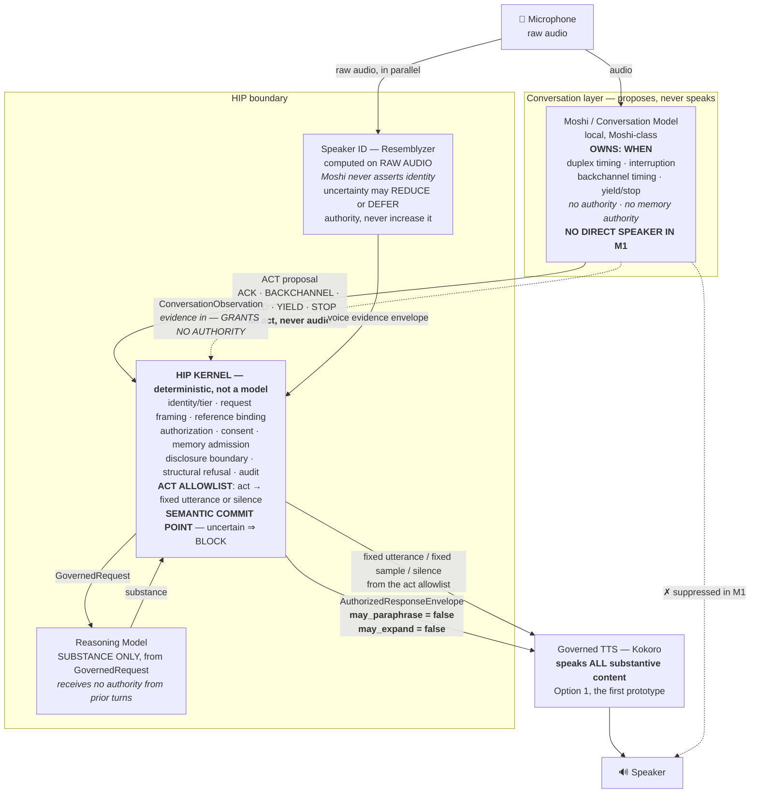
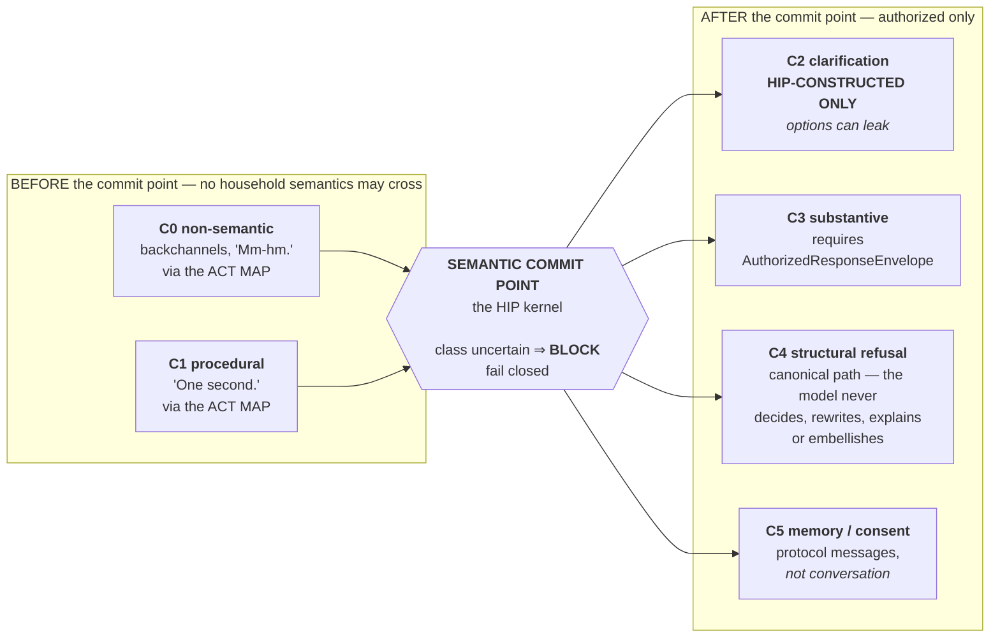
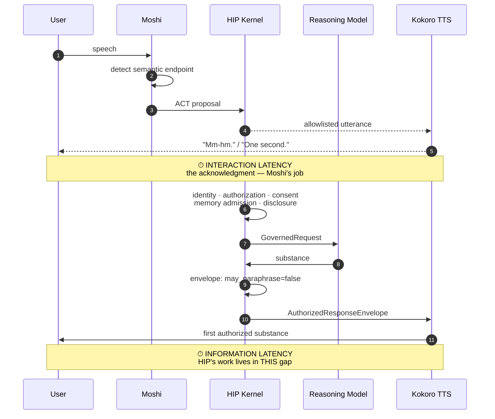
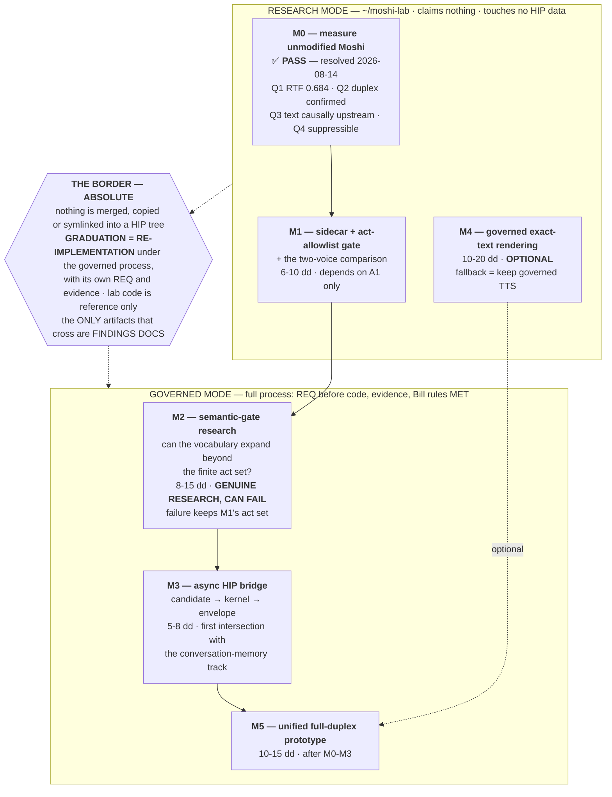

# HIP Natural Conversation — Dual-Model Architecture Diagram (AS ADOPTED)
Status: ADOPTED DIRECTION (research lane; no requirement filed)
Reconciled-Against: `roadmap` @ HA-83's commit. **Docs only** — no code, no lab run, no graph.

**Sources, and nothing else:**

* `docs/design/HIP_DESIGN__dual-model-natural-conversation-v2__v20260813_1500.md`
  — the adopted spec, which consolidates the original CGPT spec, the Fable
  review (ACCEPT WITH CHANGES, 5 changes) and the CGPT second pass. **Where v1
  and v2 differ, v2 governs and v1 is not drawn.**
* `docs/design/HIP_PROCESS__moshi-research-lane-method__v20260813_1500.md`
  — the research/governed border in D4.
* `docs/reviews/HIP_REVIEW__moshi-m0-summary__v20260814_0815.md` and the two
  findings docs it cites — the M0 and drift evidence.

---

## HOW TO READ THE LABELS

Every element carries one:

| label | meaning |
|---|---|
| **LAB-MEASURED** | measured in the M0/drift lab work, **research mode, `Verification: UNVERIFIED`** |
| **ADOPTED DESIGN** | ruled by Bill, **not built** |
| **OPEN QUESTION** | named in the sources as unresolved |

> **WHY THE LABEL READS LAB-MEASURED AND NOT PROVEN.** The M0 and drift findings
> are **RESEARCH MODE** — no REQ, no MET ruling, no harness run — and their own
> summary marks them **`Verification: UNVERIFIED`** until a separate governed
> dispatch confirms them. Drawing them as proven would be the exact failure this
> document's honesty rule targets.
>
> **RULED (Bill, HA-84): the label itself must carry the meaning.** An earlier
> draft of this document labelled these elements **PROVEN** and then explained in
> a footnote that PROVEN "means measured in the lab, never verified by the
> governed process". **That redefinition was rejected** — a reader who takes the
> label at face value, or who quotes a row without the footnote, gets a stronger
> claim than the evidence supports. **LAB-MEASURED needs no footnote to be read
> correctly.**

> **CORRECTION TO THIS DISPATCH'S OWN FRAMING.** HA-83 described M0 as
> *"provisional-pass … Q2 mic pending"*. **That is stale.** The verdict was
> `PROVISIONAL-PASS PENDING Q2 MIC` and **was resolved to PASS on 2026-08-14 by
> Bill's live microphone test**. Q2 is answered, not pending. Recorded rather than
> reproduced.

---

## D1 — RUNTIME TOPOLOGY

| element | label | basis |
|---|---|---|
| Moshi owns WHEN; proposes acts, never audio | **ADOPTED DESIGN** | v2 §1, §3 — supersedes v1's "Moshi may say harmless things itself" |
| Text is available **before** acoustic emission | **LAB-MEASURED** | M0 Q3 — and stronger than "text arrives first": *the audio for a frame is generated **from** that frame's text token*, so text is **causally upstream** of the audio an act gate would withhold |
| Audio suppressible while conversational state continues | **LAB-MEASURED** | M0 Q4 — audio withheld while the model's own state advanced through the refusal |
| Duplex works at a real microphone | **LAB-MEASURED** | M0 Q2 — Bill: *"not walkie talkie"*, *"good at finding the semantic end point of my speech"* |
| Speaker ID inside HIP's boundary, on raw audio | **ADOPTED DESIGN** | v2 §9 (Fable change 4) |
| Act allowlist as the gate | **ADOPTED DESIGN** | v2 §3 — replaces v1's phrase whitelist |
| Kernel deterministic, unchanged from the governed text path | **ADOPTED DESIGN** | v2 §2 |
| Governed TTS speaks all substance (Option 1) | **ADOPTED DESIGN** | v2 §6 |
| Moshi's own acoustic output not emitted in M1 | **ADOPTED DESIGN** | v2 §3 |

> **Why act-before-render, in the spec's own words:** *"classify-after-speech is a
> race — disclosure can precede classification. Act-before-render closes the
> race."* M0 Q3 is what makes it mechanically possible.

**OPEN QUESTION — the two-voice seam.** Moshi's interaction voice beside Kokoro's
substantive voice may simply sound worse than today's single-voice path. v2 §6
**promotes this to M1** as a three-way comparison — (a) current
Whisper→HIP→Kokoro, (b) Moshi + Kokoro, (c) Moshi timing with one renderer if
technically possible — precisely so that *"if (b) sounds worse than (a), that is
an M1 finding, not an M3 surprise."* It also bears on **G10** (naturalness),
which v2 §10 moves to M1 rather than the end.

---

## D2 — THE SEMANTIC COMMIT POINT

| class | who may produce it | side of the line |
|---|---|---|
| **C0** non-semantic | Moshi **proposes the act**; the kernel's allowlist renders it | before |
| **C1** procedural | Moshi **proposes the act**; allowlist renders | before |
| **C2** clarification | **HIP only** — *"options can leak"* | after |
| **C3** substantive | Reasoning Model, **only** via AuthorizedResponseEnvelope | after |
| **C4** structural refusal | **kernel, canonical path** — the model never decides, rewrites, explains or embellishes | after |
| **C5** memory / consent | kernel protocol messages | after |

**Failure direction: uncertain ⇒ BLOCK.** (v2 §4.)
**Label: ADOPTED DESIGN** for the whole of D2 — retained from v1 §4 and unbuilt.

**Carried constraint (ADOPTED DESIGN, tested statistically):** act selection and
timing *"must not depend on hidden household information"* — **G3**, which v2 §10
tests as a **distribution** comparison. The timing side channel is **bounded,
never claimed eliminated** (Fable change 2).

---

## D3 — LATENCY SPLIT

**The architectural claim (ADOPTED DESIGN):** splitting the two lets HIP's
authorize → retrieve → reason work occupy the gap **without the conversation
feeling dead**, because the interaction latency has already been paid by an
act that carries no semantics.

**LAB-MEASURED, and only this:** the compute can keep up. **RTF 0.684 flat at steady
state** on the M1 Pro (M0 Q1). Per-frame cost rises while the attention cache
fills, then goes flat; the server runs the Mimi codec and the LM as **two OS
processes**, so the pipeline is rate-limited by the slower stage rather than
their sum. **The model does not progressively fall behind real time.**

**OPEN QUESTION — nobody has measured the gap end to end.** No number exists for
information latency through a real kernel + reasoning model, because M3 is
unbuilt. The split is a design claim, not a measurement.

**OPEN QUESTION — the behavioural step at 4096 frames.** Response onset drifted
over Bill's live session (fast early, near barge-in later) while endpointing
stayed good. The drift study's verdict is **STATE-ARTIFACT at frame 4096**: with
input held byte-identical, the model's leaning toward speech steps up **~+2.5 to
+3.0 log-units** exactly where the KV cache fills and begins rotating. **Not
tunable** (measured before the sampler; a low-temperature arm reproduces it),
**not co-tenancy**, **not the codec** (those runs contained no codec at all).
**Any mitigation is architectural.** It bears directly on D3 because it moves
*when* Moshi decides to speak.

> **Limits carried from the source rather than smoothed:** the drift result
> measures a **decision variable, not onset latency in milliseconds**; its
> stimulus is a synthetic loop, not a conversation; the co-tenancy arm was weak
> (~7% slowdown) and the exclusion rests on the structural argument; and **no
> live full-pipeline session under real co-tenancy has ever been measured** —
> named in both sources as the gap most likely to surprise someone later.

---

## D4 — STAGE LADDER, AND THE BORDER

| stage | label | note |
|---|---|---|
| **M0** | **LAB-MEASURED** | **PASS.** Verdict was `PROVISIONAL-PASS PENDING Q2 MIC`, **resolved to PASS 2026-08-14** by Bill's live mic test |
| **M1** | **ADOPTED DESIGN** | the act gate **is** M1's architecture (Fable change 5, honestly ordered) |
| **M2** | **OPEN QUESTION** by construction | *"genuine research; can fail; failure keeps M1's act set"* |
| **M3** | **ADOPTED DESIGN** | governed mode returns here |
| **M4** | **OPEN QUESTION** | optional; **may resolve to "keep governed TTS"** |
| **M5** | **ADOPTED DESIGN** | unified prototype |

**Named M0 outcomes (ADOPTED DESIGN, the stop rule — Fable change 3):** PASS /
PARK-COMPUTE / PARK-CONTROL / FAIL-VALUE. **Any PARK or FAIL parks the lane; the
finding is the deliverable.**

### The constraint M0 found, and what it does and does not license

**LAB-MEASURED:** a hard ceiling at **4096 frames = 5 min 28 s**, in **both directions**
of the Mimi codec — one shared instance encodes the microphone and decodes the
model's voice, so **both ends fail together**. **The symptom is silence, not an
error.** Recovery is to discard and rebuild the codec: **~0.61 s**, during which
streaming state is lost.

**RULED (Bill, 2026-08-13): ACCEPTED for the research lane as a KNOWN PRODUCT
CONSTRAINT.** Periodic rotation with that gap is the M0/M1 workaround.

> **What that ruling does NOT license, stated because the distinction is the
> whole point:** it is **not discharged for the product**. A product claim
> resting on a conversation surviving past 5.5 minutes needs a real engineering
> answer — **seamless or overlapping rotation** — not this gap.

**The two constraints M1 inherits** — both land at the same frame count, for
**unrelated** reasons:

1. the **5 min 28 s codec ceiling** — any M1 experiment running longer must
   rotate the tokenizer **and say so in its own findings**, because *"a rotation
   absorbed silently leaves a reader looking at a clean long conversation that
   never happened"*;
2. the **behavioural step at 4096** — attention-cache eviction, **not a
   calibration task**; no sampler parameter reaches it.

### Sequencing (ADOPTED DESIGN)

M0 may run at any time as a bounded research spike. **Everything M1+ waits behind
the FinishPlan's demo finish line and A1.** Conversation memory (B2/B3) proceeds
independently; the tracks **intersect at M3**. **Nothing in this lane blocks,
reorders or amends the FinishPlan.**

---

## WHAT THIS DIAGRAM DELIBERATELY DOES NOT SHOW

* **v1's "Moshi may say harmless things itself"** — superseded by v2 §1.
* **v1's phrase whitelist** — replaced by the act allowlist (v2 §3).
* **Option 3** (Moshi answers freely from supplied context) — **rejected** as
  initial architecture (v2 §6).
* **Any latency number for the D3 gap** — none has been measured.
* **Any M1+ element as built.** Only M0 has evidence, and that evidence is
  research-mode and unverified.
