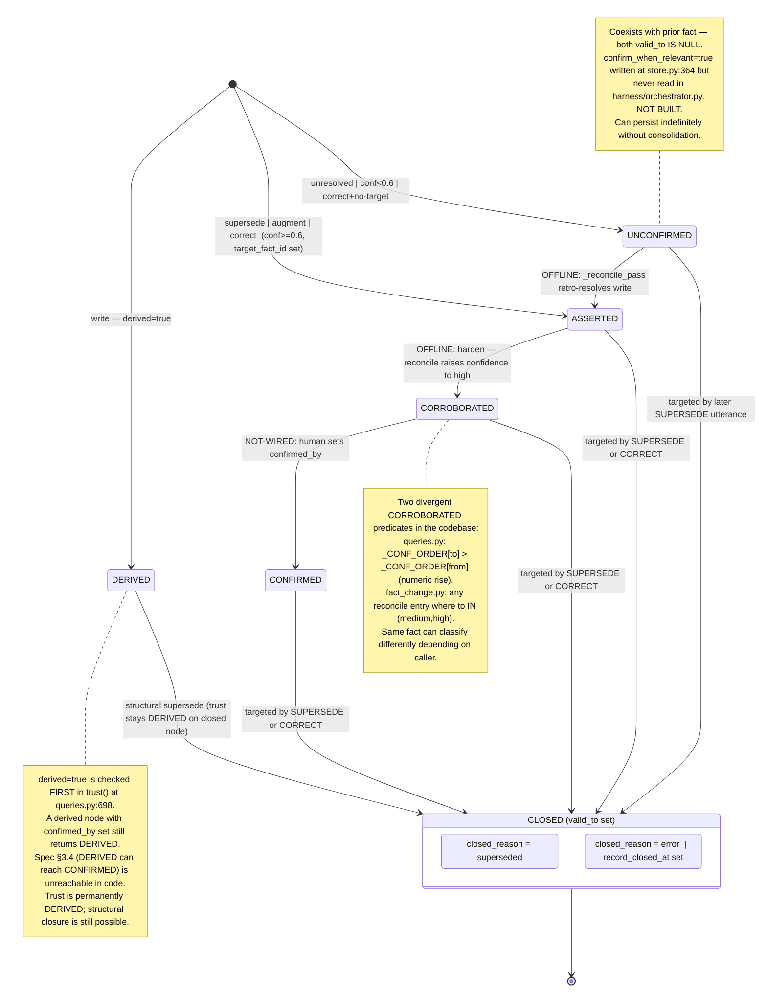

# Fact Lifecycle — State Diagram
<!-- status: BUILT — diagram derived from FACT_LIFECYCLE__state-diagram-source__v20260706_0735.md -->
<!-- source: hip-dev live code, extracted 2026-07-06 -->

Mermaid source: `FACT_LIFECYCLE_DIAGRAM__v20260706_0800.mermaid`

---

## Reasoning: How the diagram was built

### 1. States → nodes

`trust()` in `truth_layer/queries.py:694–724` is the authoritative classifier. It returns
one of five levels evaluated first-match-wins:

| Node | Trigger condition | Implemented |
|---|---|---|
| **DERIVED** | `derived == true` — wins over everything | Yes |
| **CONFIRMED** | `confirmed_by IS NOT NULL` | Yes (field written; no live setter) |
| **CORROBORATED** | `confidence == "high"` AND reconcile log entry with `to > from` AND NOT derived | Yes (queries.py); diverges in fact_change.py |
| **ASSERTED** | `write_state IN {supersede,augment,correct}` AND `confidence IN {medium,high}` AND NOT derived | Yes |
| **UNCONFIRMED** | catch-all: `write_state == "unresolved"` OR `confidence == "low"` | Yes |

Plus two composite terminal states tracking DB closure:

| Node | Fields | Notes |
|---|---|---|
| **CLOSED_SUPERSEDED** | `valid_to` set, `closed_reason="superseded"`, `superseded_by` → new uuid | Never injected; walkable via `lineage()` |
| **CLOSED_CORRECTED** | `valid_to` set, `closed_reason="error"`, `record_closed_at` set | Only write-state that sets `record_closed_at`; walkable via `correction_history()` |

**Staleness** (`queries.py:624–635`, `STALE_DAYS=180`) is an orthogonal boolean on `last_accessed`.
It never changes the trust level so it is not a separate node — left off the diagram intentionally.

---

### 2. Transitions → edges

#### Fact creation edges ([*] → state)

Three intake paths, determined by `WriteDecision.state` + `write_confidence` overrides in
`store.py:325–347`:

| New node lands at | Condition |
|---|---|
| **DERIVED** | `derived=true` set on the write |
| **ASSERTED** | `write_state ∈ {supersede, augment, correct}`, `write_confidence ≥ 0.6`, and (for CORRECT) `target_fact_id` is set |
| **UNCONFIRMED** | `write_state == unresolved` OR `write_confidence < 0.6` (any requested state capped) OR CORRECT with no `target_fact_id` (demoted) |

MULTI_VALUED attribute override (`store.py:329–332`): SUPERSEDE silently promoted to AUGMENT,
so a SUPERSEDE on a multi-valued attribute still produces an ASSERTED node — edge label
"supersede | augment | correct" covers it.

#### In-place promotion edges (same row mutated, no new node)

These are the "trust upgrade" paths. All require consolidation infrastructure that is
**built but not wired** into `harness/orchestrator.py`:

| Edge | Mechanism | Status |
|---|---|---|
| ASSERTED → CORROBORATED | `_reconcile_pass` in `consolidate.py:267` adds `confidence_log` entry, raises `confidence` to "high" | **OFFLINE-ONLY** — `consolidate.py` not called from orchestrator |
| UNCONFIRMED → ASSERTED | `_reconcile_pass` retro-applies a write-state; creates a new node at original `valid_from` (technically a new row, but conceptually resolving the same claim) | **OFFLINE-ONLY** |
| CORROBORATED → CONFIRMED | Human or system sets `confirmed_by` / `confirmed_at` | **NOT-WIRED** — no live orchestrator path sets `confirmed_by`; `must_confirm_queue` appended by `_escalate_pass` but never consumed |

#### Closure edges (prior node → CLOSED)

Any active fact (`valid_to IS NULL`) can be closed when a new write targets it:

- **→ CLOSED_SUPERSEDED**: targeted by a SUPERSEDE write (`store.py:226–260`)
- **→ CLOSED_CORRECTED**: targeted by a CORRECT write with `target_fact_id` set (`store.py:268–287`)

AUGMENT never closes any prior node — it creates a new row alongside existing rows.
UNCONFIRMED facts can be closed by a subsequent SUPERSEDE utterance (they remain `valid_to IS NULL`).

---

### 3. Spec gaps encoded in the diagram

| Gap | How shown |
|---|---|
| ASSERTED→CORROBORATED requires offline consolidation | Edge label: `OFFLINE:` prefix |
| CORROBORATED→CONFIRMED has no live setter | Edge label: `NOT-WIRED:` prefix |
| UNCONFIRMED→ASSERTED requires offline consolidation | Edge label: `OFFLINE:` prefix |
| DERIVED can never reach CONFIRMED (predicate ordering) | Note on DERIVED node |
| confirm_when_relevant flag is written but never read | Note on UNCONFIRMED node |
| Two divergent CORROBORATED predicates (queries.py vs fact_change.py) | Note on CORROBORATED node |

---

### 4. What was intentionally excluded

- **Staleness** — orthogonal boolean; no state change.
- **DERIVED can be structurally closed** — shown as `DERIVED → CLOSED` with a label note that trust stays DERIVED on the now-closed node; the *new* fact created by the supersede is not shown as DERIVED (its trust depends on its own fields).
- **ASSERTED → CONFIRMED** (skip CORROBORATED) — technically reachable if `confirmed_by` is set directly on an ASSERTED fact (CONFIRMED predicate fires before CORROBORATED); excluded because there is no live code path to set `confirmed_by` at all.
- **must_confirm_queue / escalate_pass** — queue is appended but never consumed; no state node added for a "pending confirmation" state.

---

## Diagram source

